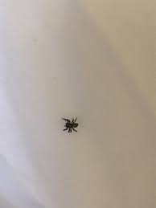

# Surprising Facts

There are many surprising facts out there, but you are sure to find one here that you haven't seen anywhere else. Strap in and get ready to get shocked.

## The Facts

1. Babies are born without kneecaps.

1. There are spiders living in the pores of your face right now.

1. The color you see in the dark is called eigengrau, or intrinsic gray.

1. There's a law in Connecticut that pickles must bounce.

1. The tiny pocket above the actual pocket in your jeans is for pocket watches.

1. Your nose and ears never stop growing throughout your life.

1. People can have bodily functions even after death.

1. The game Among Us is not new; it was just found and made popular by streamers and gamers.

